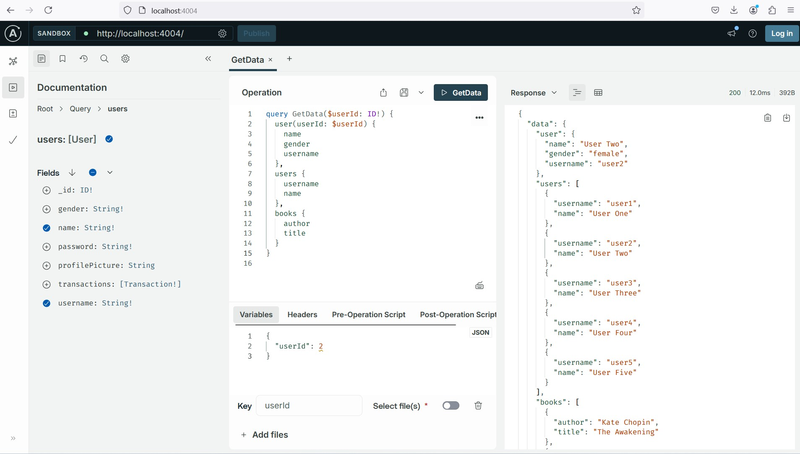

### Install 
- `npm init --yes && npm pkg set type="module"`
- `npm install @apollo/server graphql`



### Run 
- `npm start`
- `http://localhost:4044`

### Example: Get all books
- REQUEST 
    ```js
    fetch('http://localhost:4044', {
        method: 'POST',
        headers: {
            'Content-Type': 'application/json',
        },
        body: JSON.stringify({
            // Specify which operation to run
            operationName: 'FetchBooks',
            query: `
                query FetchBooks {
                    getBooks {
                        id
                        title
                        author
                        publishedYear
                    }
                }
            `
        })
    });
    ```
- RESPONSE
    ```
    {
        "data": {
            "getBooks": [
                {
                    "id": 1,
                    "title": "The Awakening",
                    "author": "Kate Chopin",
                    "publishedYear": 2010
                },
                {
                    "id": 2,
                    "title": "City of Glass",
                    "author": "Paul Auster",
                    "publishedYear": 2020
                }
            ]
        }
    }
    ```
### Example: Get a single book by ID
- REQUEST `POST http://localhost:4044/`
    ```
    query {
        getBookById(id: 1) {
            id
            title
            author
            publishedYear
        }
    }
    ```
- RESPONSE
    ```
    {
        "data": {
            "getBookById": {
                "id": 1,
                "title": "The Awakening",
                "author": "Kate Chopin",
                "publishedYear": 2010
            }
        }
    }
    ```

### Example: Add a new book
- REQUEST `POST http://localhost:4044/`
    ```
    mutation {
        addBook(
            title: "To Kill a Mockingbird", 
            author: "Harper Lee", 
            publishedYear: 1960
        ) {
            id
            title
            author
            publishedYear
        }
    }
    ```
- RESPONSE
    ```
    {
        "data": {
            "addBook": {
                "id": 3,
                "title": "To Kill a Mockingbird",
                "author": "Harper Lee",
                "publishedYear": 1960
            }
        }
    }
    ```

### Example: Update a book:
- REQUEST `POST http://localhost:4044/`
    ```
    mutation {
        updateBook(
            id: 1, 
            title: "1984 (Updated)", 
            author: "George Orwell", 
            publishedYear: 1949
        ) {
            id
            title
            author
            publishedYear
        }
    }
    ```
- RESPONSE
    ```
    {
        "data": {
            "updateBook": {
                "id": 1,
                "title": "1984 (Updated)",
                "author": "George Orwell",
                "publishedYear": 1949
            }
        }
    }
    ```

### Example: Delete a book
- REQUEST `POST http://localhost:4044/`
    ```
    mutation {
        deleteBook(id: 2) {
            id
            title
            author
            publishedYear
        }
    }
    ```
- RESPONSE
    ```
    {
        "data": {
            "deleteBook": {
                "id": 2,
                "title": "City of Glass",
                "author": "Paul Auster",
                "publishedYear": 2020
            }
        }
    }
    ```

### Example: Multiple book operations
- REQUEST `POST http://localhost:4044/`
    ```
    mutation PerformMutations {
        # 1. Insert first new book
        book1: addBook(
            title: "The Hobbit", 
            author: "J.R.R. Tolkien", 
            publishedYear: 1937
        ) {
            id
            title
            author
            publishedYear
        }

        # 2. Insert second new book
        book2: addBook(
            title: "The Catcher in the Rye", 
            author: "J.D. Salinger", 
            publishedYear: 1951
        ) {
            id
            title
            author
            publishedYear
        }

        # 3. Update an existing book (book with ID 1)
        updateBook(
            id: 1, title: "1984 (Updated Again)", 
            author: "George Orwell", 
            publishedYear: 1949
        ) {
            id
            title
            author
            publishedYear
        }

        # 4. Delete a book (book with ID 2)
        deleteBook(id: 2) {
            id
            title
            author
            publishedYear
        }
    }

    query FetchBooks {
        # 5. Fetch all remaining books
        getBooks {
            id
            title
            author
            publishedYear
        }
    }
    ```

- RESPONSE
    ```
    {
        "data": {
            "book1": {
                "id": 3,
                "title": "The Hobbit",
                "author": "J.R.R. Tolkien",
                "publishedYear": 1937
            },
            "book2": {
                "id": 4,
                "title": "The Catcher in the Rye",
                "author": "J.D. Salinger",
                "publishedYear": 1951
            },
            "updateBook": {
                "id": 1,
                "title": "1984 (Updated Again)",
                "author": "George Orwell",
                "publishedYear": 1949
            },
            "deleteBook": {
                "id": 2,
                "title": "City of Glass",
                "author": "Paul Auster",
                "publishedYear": 2020
            }
        }
    }
    ```

### Example Multi Request
- REQUEST: `POST http://localhost:4044/`
    ```
    query GetData($userId: ID!) {
        user(userId: $userId) {
            name
            gender
            username
        },
        users {
            username
            name
        },
        books {
            author
            title
        }
    }
    ```
- RESPONSE:
    ```
    {
        "data": {
            "user": {
                "name": "User Two",
                "gender": "female",
                "username": "user2"
            },
            "users": [
                {
                    "username": "user1",
                    "name": "User One"
                },
                {
                    "username": "user2",
                    "name": "User Two"
                },
                {
                    "username": "user3",
                    "name": "User Three"
                },
                {
                    "username": "user4",
                    "name": "User Four"
                },
                {
                    "username": "user5",
                    "name": "User Five"
                }
            ],
            "books": [
                {
                    "author": "Kate Chopin",
                    "title": "The Awakening"
                },
                {
                    "author": "Paul Auster",
                    "title": "City of Glass"
                }
            ]
        }
    }
    ```


### References 
- [Get started with Apollo Server](https://www.apollographql.com/docs/apollo-server/getting-started)
- [GraphQL Crash Course in 2024 | Build a Full Stack MERN App](https://www.youtube.com/watch?v=Vr-QHtbmd38)
- [GraphQL Best Practices](https://graphql.org/learn/best-practices/)