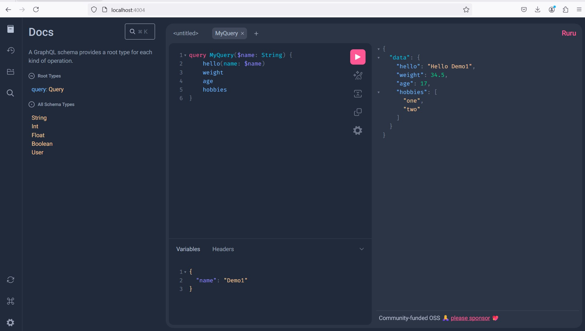

### Client

`POST http://localhost:4004/graphql`
```js
{
    "query": `
        query MyQuery($name: String) { 
            hello(name: $name) 
            weight 
            age 
            hobbies
        }
    `,
    "variables": { 
        "name": "Demo1" 
    }
}
```




### References
- [Getting Started With GraphQL.js](https://graphql.org/graphql-js/)
- [Running Express + GraphQL](https://graphql.org/graphql-js/running-an-express-graphql-server/)
- [Build and Deploy a GraphQL API using NodeJS](https://www.youtube.com/watch?v=UYQSVH6B1k4)